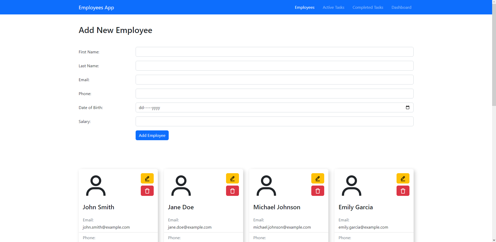

# Employees CRUD

## About

### Employees page

On this page user can edit and delete existing employees or add new ones. Delete buttons have confirmation dialog to prevent accidental deletion.

### Active Tasks page

On this page user can edit and delete existing tasks or add new ones. Delete buttons have confirmation dialog to prevent accidental deletion.
Every task can be marked as completed by clicking on designated button which also have confirmation dialog. If task is marked as completed it is transferred from active to completed tasks. For every completed task employee gains additional point for the current month.

### Completed Tasks page

On this page user can only preview completed tasks. Tasks can be filtered to show all of them or only tasks completed in current month. Initially, current month is the first month so it will show all tasks.

### Dashboard page

Monthly statistics shown on dashboard:

- Total number of employees
- Total number of tasks
- Number of completed tasks
- Number of uncompleted tasks
- Top 5 employees with highest number of completed tasks   &Tab;\* List can have less than 5 employees because employees with 0 completed tasks are not ranked

Dashboard displays statistics for current and past month. Initially, data for the past month is not available until the end of current month.

## Libraries and Frameworks

1. React
2. [React-Bootstrap](https://react-bootstrap.github.io)
3. [React-Icons](https://react-icons.github.io/react-icons/)
